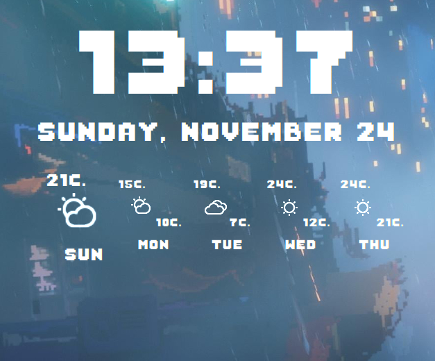
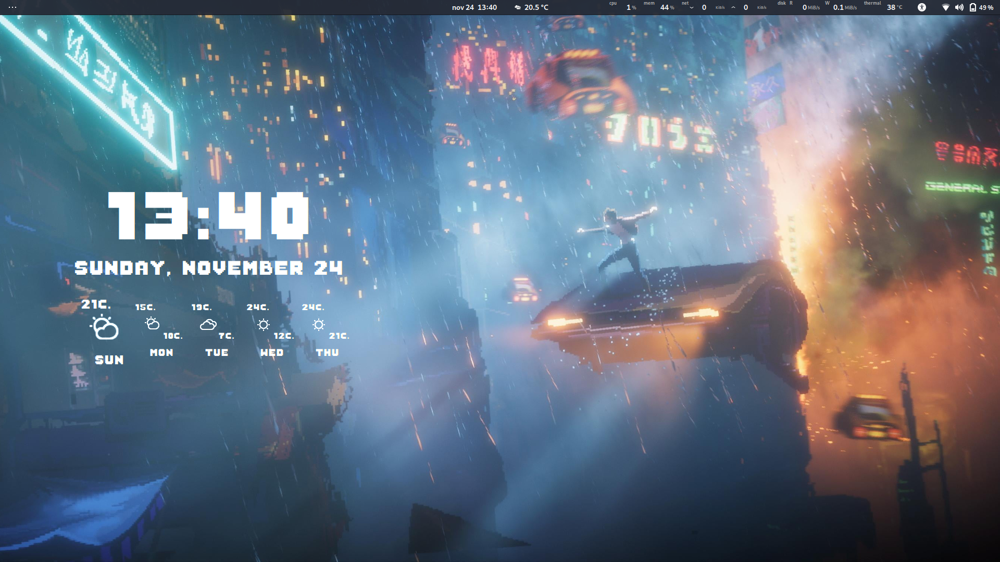

### Vision -- Pixel Art Version

A theme forked from Conky-Vision by zagortenay333 which I was Inspired to.
[Conky-Vision by zagortenay333](https://github.com/zagortenay333/conky-Vision)

It already have the font to look like the preview [Sabo](https://www.1001freefonts.com/sabo.font) by [Philippe Moesch](https://www.behance.net/philippemoesch)

Need help with the SVG forecast (Change into Pixel Art Style) because they kinda mismatch with the theme.

This fork was for personal use to integrate in my desktop but decided to release it for anyone interested in using or modifying this theme.

From now on is the same steps just like conky-vision
---

### Installation

You can run the `install` script, or you can do it manually:

* Install **conky**, **curl** and **jq**.

* Move the `.conky-vision` folder & `.conkyrc` file into your `~` dir.

**NOTE** some files/folders are hidden; unhide them. :smile:

---

### API Key

For now, you need to register a private API key on [OpenWeatherMap](http://openweathermap.org/) to get weather data.

Place the API key in the `template6` variable inside the `.conkyrc`file.

---

### City

[Find the ID of your city](http://bulk.openweathermap.org/sample/) and place it inside the `template7` variable inside the `.conkyrc` file.

---

### Language

By default this conky will use your default locale.

Edit the `template9` variable in the `.conkyrc` file to change the language.

---

### Units

Edit the `template8` variable inside the `.conkyrc` file to change the units.

---

### Font

Edit the ``Sabo-Filled`` lines inside the `.conkyrc` file to change the font to your liking.

---

### Colors

* Edit the `color` variables inside the `.conkyrc` file to change **text** color.

* To change the **icon** colors, use the `render-pngs` script to render a folder of icons with the desired color, then change the icon sources in the `.conkyrc` file under the `Icon Sources` section.

    > * The script requires **inkscape**.
    > * The script uses the `SVG` folder to render png's.
    > * You should keep the size at **32(px)** for this conky.

---

